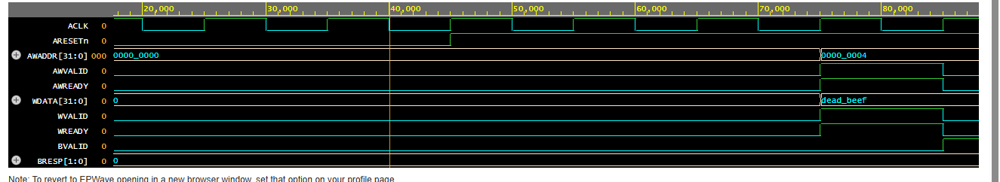
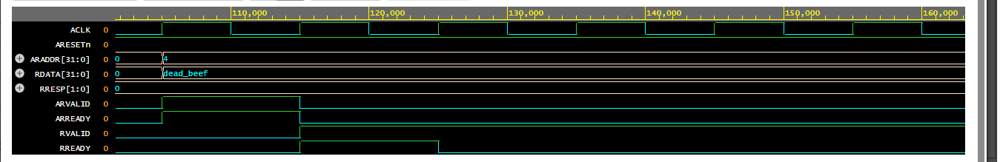

# AXI4-Lite Slave Register Bank

A synthesizable **AXI4-Lite slave** with 4 internal 32‑bit registers, implemented in Verilog.  
Follows the ARM AMBA AXI4‑Lite protocol with fully independent read/write channels, robust VALID/READY handshaking, and memory boundary protection. Verified with a self‑checking testbench and comprehensive waveform analysis.

---

## 📋 Features
- **Full AXI4-Lite Compliance:** Implements all 5 independent channels (AW, W, B, AR, R).
- **Independent Channel Latching:** The AW and W channels are fully decoupled, allowing Address and Data to arrive on different clock cycles without stalling the bus.
- **Address Decoding & Protection:** Evaluates target addresses and returns a `DECERR` (2'b11) response code if the Master attempts an out-of-range memory access.
- **Synthesizable RTL:** Strictly utilizes single-clock domain synchronous logic (no combinational loops or behavioral delays).
- **Self‑Checking Testbench:** Automated Master emulation tasks with built-in PASS/FAIL logic.

---

## 🧱 Address Map
| Register | Offset | `addr[3:2]` | Access |
|----------|--------|-------------|--------|
| reg0     | 0x00   | 00          | R/W    |
| reg1     | 0x04   | 01          | R/W    |
| reg2     | 0x08   | 10          | R/W    |
| reg3     | 0x0C   | 11          | R/W    |

---

## ⚙️ Design Architecture

### Write Transaction (Latch-Based FSM)
- `AW` and `W` channels are monitored independently. `AWADDR` and `WDATA` are captured into internal latches the moment their respective `VALID` signals arrive.
- Once *both* latches are full, the Slave performs an address boundary check.
- If valid, data is written to `mem[AWADDR[3:2]]` and `BVALID` is asserted with `BRESP = 00` (OKAY).
- If invalid, the write is blocked and `BRESP = 11` (DECERR) is returned.

### Read Transaction
- Waits in `IDLE` for `ARVALID`.
- Accepts address (`ARREADY`) and immediately validates the boundary.
- If valid, fetches data from `mem[ARADDR[3:2]]` and asserts `RVALID` with `RDATA` and `RRESP = 00`.
- On `RREADY`, deasserts `RVALID` and returns to `IDLE`.

---

## 🧪 Verification & Waveforms

The testbench (`tb_axi_lite_slave.v`) models a CPU master verifying the "Happy Path" (valid reads/writes) and "Robustness" (illegal addresses). 

### 1. Write Transaction
Detailed view of the Write Channel handshakes, demonstrating the successful capture of Address (`0x04`) and Data (`0xDEADBEEF`), followed by the `OKAY` receipt.
  

### 2. Read Transaction
Detailed view of the Read Channel handshake, confirming successful data retrieval from the memory-mapped register.
  

### 3. Full System & Robustness Check
Full simulation trace demonstrating overarching FSM stability. Note the final transaction where the Master attempts to write to an illegal address (`0xF0`), and the Slave correctly traps it by returning a `DECERR` (`11`) response.
  

---

## 🔬 Simulation & Debugging
Key RTL challenges resolved during development:
1. **Independent Channel Race Conditions:** Initially, the FSM assumed `AW` and `W` signals would arrive simultaneously. This was re-architected into a robust latch-based system to handle asynchronous arrival times per the AXI specification.
2. **Non-Blocking Overwrites:** Fixed a bug where `BVALID` and `RVALID` were being overwritten in the same clock cycle due to improper assignment logic, ensuring the `VALID`/`READY` handshake completes gracefully.
3. **Simulation Timeout Freezes:** Abstracted the safety `#1000` timeout into an independent, concurrent `initial` block to prevent it from blocking sequential testbench tasks.

---

## 📁 Files
- `/src/axi_lite_slave.v` – RTL design
- `/tb/tb_axi_lite_slave.v` – Testbench
- `/img/` – Waveform evidence

---

## 🔮 Future Upgrades
- Parameterize data width and register count.
- Build a custom AXI4-Lite Master (Hardware Accelerator) to interface with this block.
- Synthesize on FPGA (Xilinx Vivado) to extract area and timing reports.

---

## 👤 About the Author
**Lakxmi Priya A.** Electrical and Electronics Engineering (EEE) Undergrad at National Institute of Technology (NIT), Tiruchirappalli.  
*Built to demonstrate AXI4-Lite protocol understanding and RTL verification in a digital design portfolio.*
