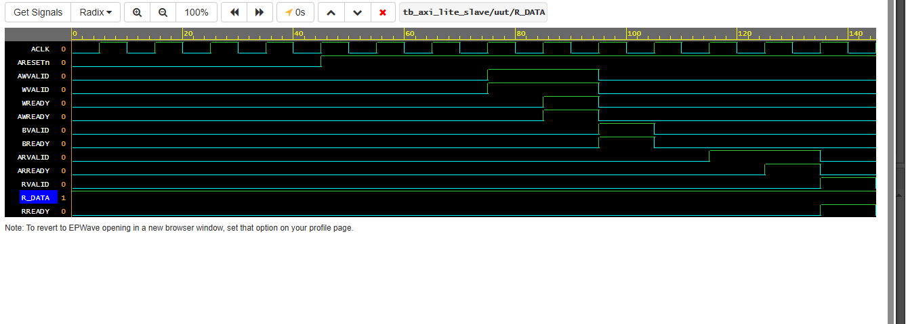

# AXI4-Lite Slave Register Bank

A synthesizable **AXI4-Lite slave** with 4 internal 32‑bit registers, implemented in Verilog.  
Follows the ARM AMBA AXI4‑Lite protocol with independent read/write channels and full VALID/READY handshake.  
Verified with a self‑checking testbench and waveform analysis.

---

## 📋 Features
- 5 AXI4-Lite channels: AW, W, B, AR, R
- 4 × 32‑bit internal registers (address decode via `addr[3:2]`)
- 2‑state FSMs for write and read transactions
- Fully compliant VALID/READY handshake
- Synthesizable RTL (single clock domain, no behavioral delays)
- Self‑checking testbench with PASS/FAIL
- Waveform verification (GTKWave / EPWave)

---

## 🧱 Address Map
| Register | Offset | `addr[3:2]` |
|----------|--------|-------------|
| reg0     | 0x00   | 00          |
| reg1     | 0x04   | 01          |
| reg2     | 0x08   | 10          |
| reg3     | 0x0C   | 11          |

---

## ⚙️ Design

### Write Transaction
- Wait in `IDLE` until `AWVALID` and `WVALID` are both high.
- Assert `AWREADY` and `WREADY`, write `WDATA` to `mem[AWADDR[3:2]]`.
- Move to `RESP` state, assert `BVALID` with `BRESP = 00` (OKAY).
- On `BREADY`, deassert `BVALID` and return to `IDLE`.

### Read Transaction
- Wait in `IDLE` for `ARVALID`.
- Accept address (`ARREADY`), fetch data from `mem[ARADDR[3:2]]`.
- Move to `DATA` state, assert `RVALID` with `RDATA`.
- On `RREADY`, deassert `RVALID` and return to `IDLE`.

Both FSMs run independently → simultaneous read/write allowed.

---

## 🧪 Verification

**Testbench (`tb_axi_lite_slave.v`):**
- Models a CPU master with `axi_write` and `axi_read` tasks.
- Writes `0xDEADBEEF` to register 1 (address `0x04`).
- Reads back and checks response codes (`BRESP`, `RRESP`) and data.
- Prints **PASS** or **FAIL**.

**Waveform:**
  

The waveform confirms correct handshake timing, data storage, and protocol compliance.

---

## 🔬 Simulation & Debugging
Key RTL challenges resolved during development:
1. **Race Conditions:** Non‑blocking assignments (`<=`) were used for all master‑driven stimuli to avoid the slave missing `VALID` pulses due to Verilog event ordering.
2. **Phantom Handshakes:** The `W_RESP` and `R_DATA` states now explicitly force `AWREADY`/`WREADY` low, preventing the slave from accidentally accepting a new transaction while still responding.
3. **Simulation Timeout:** A safety `initial` block with `#1000` timeout was used to break hangs, and test calls were placed immediately after reset to ensure they execute.

---

## 📁 Files
- `axi_lite_slave.v` – RTL design
- `tb_axi_lite_slave.v` – Testbench
- `AXI_LITE.png` – Waveform evidence
- `README.md` – This file

---

## 🔮 Todo / Learning Path
- Add `SLVERR` for out‑of‑range register addresses
- Parameterize number of registers
- Synthesize on FPGA (Vivado) and check area/timing

---

## 👤 Author
-Lakxmi priya A, EEE Undergrad at National Institute of Technology, Tiruchirappalli.

---

*Built to demonstrate AXI4-Lite protocol understanding and RTL verification in a digital design portfolio.*
